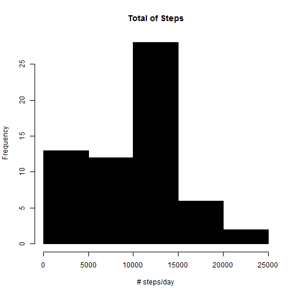
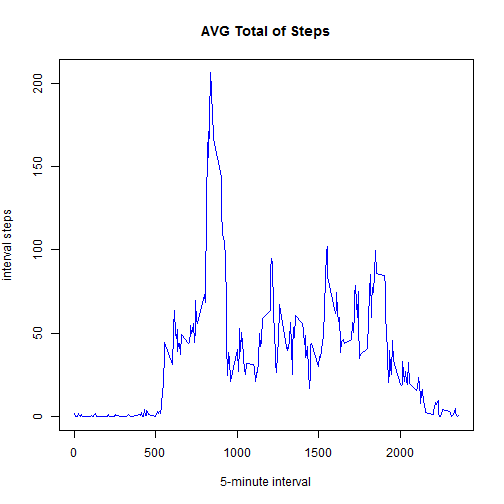
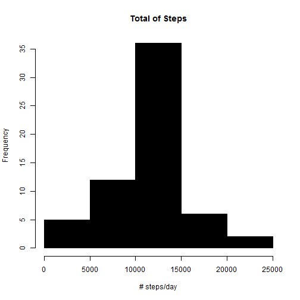
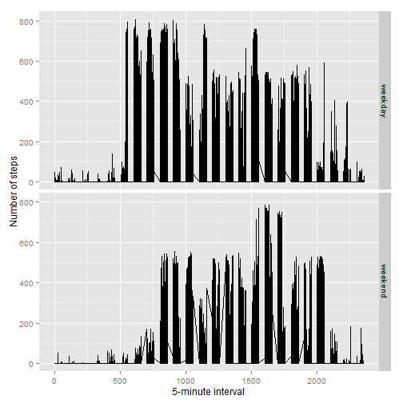

# Reproducible Research: Peer Assessment 1


### Loading and preprocessing the data
Load the data (i.e. read.csv())

Process/transform the data (if necessary) into a format suitable for your analysis


```r
setwd("C:/Temp/RepData")

url <- "https://d396qusza40orc.cloudfront.net/repdata%2Fdata%2Factivity.zip"
destfile <- "activity.zip"
  
download.file(url, destfile)

unzip(destfile)
data <- read.csv("./activity.csv", sep=",", header = TRUE)
```

### What is mean total number of steps taken per day?
Calculate the total number of steps taken per day

```r
totsteps <- tapply(data$steps, data$date, sum, na.rm=TRUE)
```

Make a histogram of the total number of steps taken each day

```r
hist(totsteps, xlab="# steps/day",ylab="Frequency", main="Total of Steps", col = "black")
```

 

Calculate and report the **mean** and **median** total number of steps taken per day

**mean**

```r
mean(totsteps, na.rm=TRUE)
```

```
## [1] 9354.23
```

**median**

```r
median(totsteps, na.rm=TRUE)
```

```
## [1] 10395
```

### What is the average daily activity pattern?
Make a time series plot (i.e. type = "l") of the 5-minute interval (x-axis) and the average number of steps taken, averaged across all days (y-axis)


```r
avg <- aggregate(x=list(steps=data$steps), by=list(interval=data$interval), FUN=mean, na.rm=TRUE)

plot(avg, interval~steps,xlab="5-minute interval",main="AVG Total of Steps", type="l", col="blue")
```

 

Which 5-minute interval, on average across all the days in the dataset, contains the maximum number of steps?


```r
max(mean(data$steps, na.rm=TRUE))
```

```
## [1] 37.3826
```


### Imputing missing values
Calculate and report the total number of missing values in the dataset (i.e. the total number of rows with NAs)


```r
missing <- is.na(data$steps)
table(missing)
```

```
## missing
## FALSE  TRUE 
## 15264  2304
```

Devise a strategy for filling in all of the missing values in the dataset. The strategy does not need to be sophisticated. For example, you could use the mean/median for that day, or the mean for that 5-minute interval, etc.

**Missing values will going to receive mean of the 5-minute interval**


Create a new dataset that is equal to the original dataset but with the missing data filled in


```r
valueNew <- function(steps, interval) {
 replaced <- NA
  if (!is.na(steps))
    replaced <- c(steps)
  else
    replaced <- (avg[avg$interval==interval, "steps"])
  return(replaced)
}
dataNew <- data
dataNew$steps <- mapply(valueNew, dataNew$steps, dataNew$interval)
```

Make a histogram of the total number of steps taken each day and Calculate and report the mean and median total number of steps taken per day. Do these values differ from the estimates from the first part of the assignment? What is the impact of imputing missing data on the estimates of the total daily number of steps?


```r
totsteps2 <- tapply(dataNew$steps, dataNew$date, sum)
hist(totsteps2, xlab="# steps/day",ylab="Frequency", main="Total of Steps", col = "black")
```

 

**mean**

```r
mean(totsteps2)
```

```
## [1] 10766.19
```

**median**

```r
median(totsteps2)
```

```
## [1] 10766.19
```

### Are there differences in activity patterns between weekdays and weekends?

Create a new factor variable in the dataset with two levels - "weekday" and "weekend" indicating whether a given date is a weekday or weekend day.


```r
isWeekend <- function(date) {
  day <- format(as.Date(date), "%w")
  if (day %in% c(0,6))
    return(TRUE)
  else 
    return(FALSE)
}
```

Make a panel plot containing a time series plot (i.e. type = "l") of the 5-minute interval (x-axis) and the average number of steps taken, averaged across all weekday days or weekend days (y-axis). The plot should look something like the following, which was creating using **simulated data**:

```r
avg2 <- aggregate(data$steps ~ data$interval + data$date, FUN=mean, na.rm=TRUE)
colnames(avg2) <- c("interval","date","steps")

i <- 1
while (i < nrow(avg2) )
{
  avg2[i,"day"] <- if (format(as.Date(avg2[i,2]), "%w") %in% c(0,6)) "weekend" else "weekday"
  i <- i+1
}

avg3 <- subset(avg2, day %in% c("weekend","weekday"))

ggplot(avg3, aes(interval, steps)) + geom_line() + facet_grid(day ~ .) +
  xlab("5-minute interval") + ylab("Number of steps")
```

 
